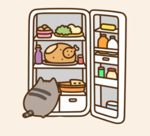
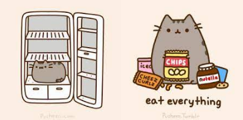
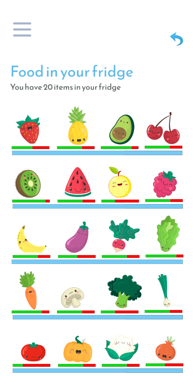
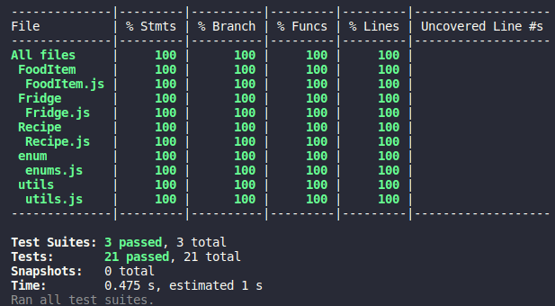

<h1 align="center">
    <br>
    <p align="center">No Waste {reprograma}<p>
</h1>
      <p align="center">The more you know, the less you throw

<p align="center">
  
</p>


## 1. Qual o problema? 

<br>

<p align="justify">
A cadeia de abastecimento alimentar está a caminho de se tornar a maior contribuinte para a emissão dos gases de efeito estufa (GEE) em todo o mundo. Os gases são gerados em cada etapa do sistema de fornecimento de alimentos, independentemente de o alimento produzido ser consumido. 

Estima-se que 14% dos alimentos do mundo são perdidos entre a colheita e o varejo, e que 17% são desperdiçados no varejo e no nível de consumo. Isto ocorre numa época em que 811 milhões de pessoas passam fome.

A perda de alimentos é responsável por 8 a 10% dos GEEs globais - contribuindo para um clima instável e eventos climáticos extremos, como secas e enchentes. Estas mudanças afetam o rendimento dos cultivos, reduzem a qualidade nutricional dos alimentos, causam rupturas na cadeia de fornecimento e ameaçam a segurança alimentar. Isto posto, há necessidade de rever processos e comportamentos a fim de reduzir a perda e o desperdício de alimentos.

Setores de produção, estoque, manuseio e venda devem estar conectados para desenvolver soluções que deem novos rumos aos produtos que seriam descartados. 
Já no que tange às ações individuais, o noWaste se apresenta como alternativa, fundamentado na crença de que pequenas ações podem levar a grandes mudanças. Coletivamente podemos construir um futuro mais sustentável onde nossos recursos mais preciosos sejam compartilhados, não desperdiçados. 

    
[UNEP - United Nations Environment Programme ](https://www.unep.org/pt-br/events/un-day/dia-internacional-de-conscientizacao-sobre-perda-e-desperdicio-de-alimentos-2022#:~:text=Estima%2Dse%20que%2014%25%20dos,milh%C3%B5es%20de%20pessoas%20passam%20fome.)
    
<br>    
    
## 2. O que propõe o projeto <strong>No Waste</strong>?     
    
<p align="justify"> o No Waste surge com a proposta de conectar vizinhos para que os alimentos excedentes possam ser compartilhados em vez de descartados. Podem ser itens perto da data de validade, sobras de vegetais cultivados em casa, ou quaisquer mantimentos que a pessoa possua na geladeira. 

Ao capacitar comunidades locais com uma solução gratuita, acessível e eficaz para reduzir o desperdício, o no Waste acredita ser capaz de ter um impacto duradouro e significativo no mundo, uma ação de cada vez.
<br>
<br>
<p align="center">
  
 
</p>


<br>
  
 ## 3. Como vai funcionar? 
  
<p><strong>No Waste</strong> é um aplicativo para compartilhamento de alimentos, com o objetivo de reduzir o desperdício e estimular o consumo consciente. Faz isso conectando aqueles com alimentos excedentes àqueles que precisam ou desejam consumir esses alimentos. A comida pode ser crua ou cozida, fechada ou aberta.</p> 

<p> Para disponibilizar um item, basta acessar e selecionar a opção de oferta inserindo deste modo o item na vitrine coletiva. Para visualizar os itens disponibilizados, deve-se navegar pela listagem de itens dispostos. Para promover a qualidade dos items que serão doados, o No Waste possui inteligência para avaliar a validade dos itens que estão na geladeira e assim, por meio do aplicativo, o usuário pode antes de ofertar um item para doação verificar quais estão próximos ao vencimento, bem como sugestões de receitas caso o desejo seja consumir aquele produto. </p> <br>

<p> Assim, diferentes abordagens são contempladas no intuito de eliminar o desperdício. 
</p>

<p>
Nenhuma cobrança é admitida pela política do aplicativo.
</p>

<br>
<p align="center">
  
</p>

<br>


## 4. Tecnologias utilizadas:
| Ferramenta | Descrição |
| --- | --- |
| `javascript` | Linguagem de programação. |
| `nodejs` | Runtime JavaScript baseado no interpretador V8 do Google | 
| `npm ou yarn` | Gerenciador de pacotes.|
| `jest` | Framework de testes em JavaScript.|


<br>
<br>

## 5 - Documentação do aplicativo
    
### 1 - Listar produtos na geladeira
    
```
=== Products in the Fridge ===

danone fit
farmer milk
beet
orange
```
### 2 - Listar produtos próximos ao vencimento
    
```
=== Products close to expiry ===

The following items will expire: farmer milk, orange
```

### 3 - Listar receitas com os produtos próximos ao vencimento
    
```
=== Recipes with items that will expire ===

Check out some recipe suggestions for consumption of items close to expiration: 

Recipes you can do with farmer milk: Milk Pudding, Chocolate Cake

Recipes you can do with orange: Sex On the Beach
```

### 4 - Listar receitas com um produto específico próximos ao vencimento
    
```
=== List recipes for a specific product close to expiration ===

Enter an item to check recipe suggestions for it: farmer milk
[ Recipe { recipeName: [ 'Milk Pudding', ' Chocolate Cake' ] } ]
```

### 5 - Verificar validade de um item
    
```
=== Check an item's expiration date ===

Enter an item to check its expiration date: farmer milk
farmer milk will expire today!!!

outro exemplo:

beet will expire in 11 days.
```
### 6 - Disponibilizar um item para doação
    
```
Enter an item to offer: farmer milk

farmer milk offered and available for donation.

orange offered and available for donation.
```

### 7 - Listar itens disponíveis para doação
    
```
=== Show items available ===
FoodItem {
  name: 'farmer milk',
  expirationDate: '2022-12-07',
  category: 'DairyProducts'
}
FoodItem {
  name: 'orange',
  expirationDate: '2022-12-8',
  category: 'Fruits'
}

```

<br>
<br>
    
## 6 - Regras de negócio 
    
- Um item só pode ser adicionado a partir da data atual impedindo disponibilização de produtos vencidos.
- Apenas itens comestíveis permitidos.
- As receitas são sugeridas para os itens que estão próximos ao vencimento.
    
<br>
<br>
    
## 7 - Implementações Futuras

* Integração com estabelecimentos tais como restaurantes, padarias entre outros para oferta de itens próximos ao vencimento que não foram utilizados;
*  Inclusão de serviço de retirada e entrega;
*  Rankeamento dos estabelecimentos e usuários que mais compartilham;
*  Parcerias que promovam recompensas para os que se destacarem no ranking tais como redução de impostos para os estabelecimentos acima mencionados e/ou descontos nestes para os clientes pessoas físicas que obtém elevada pontuação, atraindo clientes e estimulando a prática simultaneamente.
*  Criação de cadastro de comunidades para receber doações.
*  Criação de cadastro de voluntários para auxiliar na arrecadação e distribuição de alimentos.  
    
<br>
<br>
    
## 8 - Cobertura de testes

<p align="center">
  
</p>
    
<br>
<br>

## 9. Para rodar
    
1. Faça o download ou clone este repositório;
2. Rode: **$ npm install**;
3. Para executar:  **$ npm run start**
4. Coverage: **$ npm run coverage**
<br>
<br>
      
    
## 10. Autora 👩‍💻    
     
  ### Mariana Trombini
- [Linkedin](https://www.linkedin.com/in/mariana--trombini/)
- [Github](https://github.com/maritrombini)